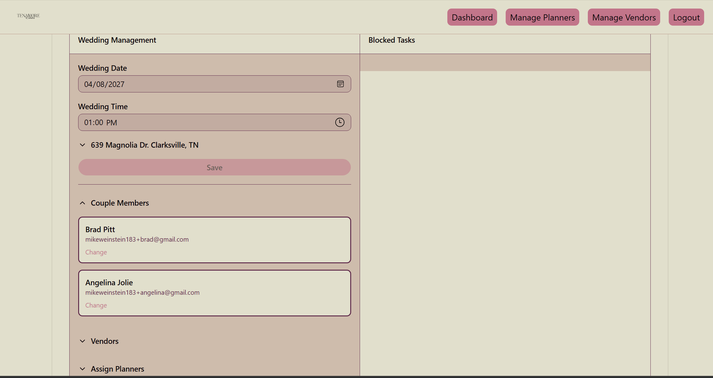
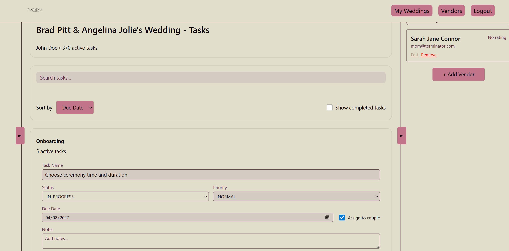
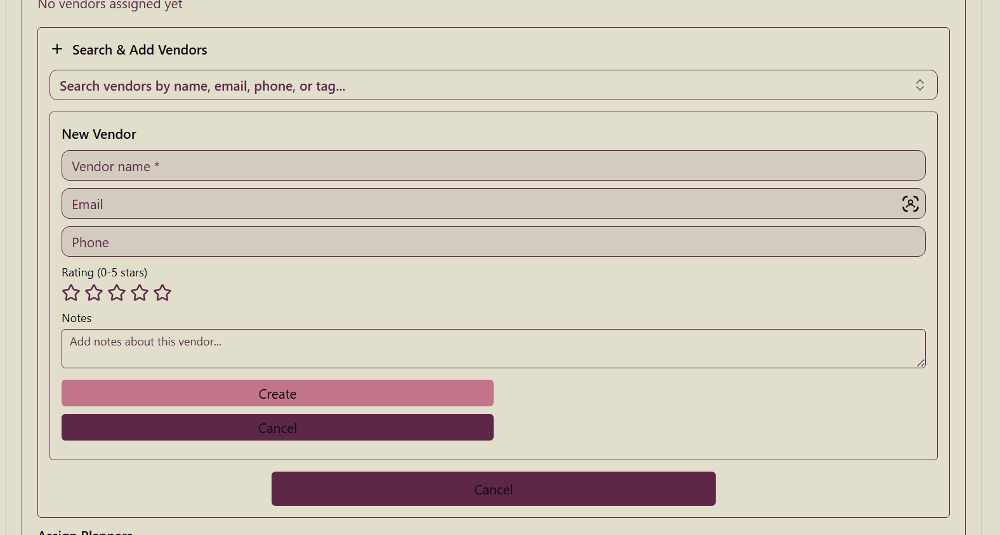
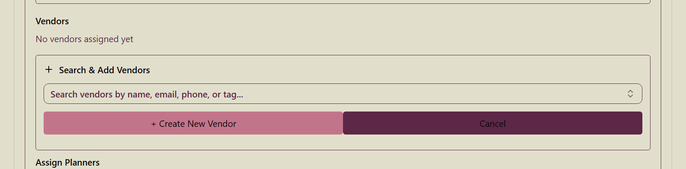

# Final Design Report

## Table of Contents
- [Project Description](#project-description)
- [User Interface Specification](#user-interface-specification)
- [Test Plan & Results](#test-plan--results)
- [User Manual](#user-manual--incl-faq)
- [Spring Final PPT Presentation](#spring-final-ppt-presentation)
- [Final Expo Poster](#final-expo-poster)
- [Assessments](#assessments)
- [Summary of Hours and Justification](#summary-of-hours-and-justification)
- [Summary of Expenses](#summary-of-expenses)
- [Appendix](#appendix)

---

## Project Description

### Abstract
The Tenamore Wedding Planner Application is a comprehensive web-based system designed to streamline wedding planning from initial consultation to final execution. This application helps administrators manage staff, planners organize weddings, and couples track their wedding preparations in real time.

### Key Features
- **Multi-role Access Control**: Different interfaces and permissions for admins, planners, and couples  
- **Template-Based Task Generation**: Automatically create comprehensive task checklists from customizable templates  
- **Date-Aware Task Management**: Tasks automatically adjust due dates based on the wedding date  
- **Real-time Collaboration**: Couples and planners can view and update tasks together  
- **Vendor Management**: Track vendors, ratings, and contact information  
- **Role-Based Dashboards**: Each user type sees relevant information for their role  

---

## User Interface Specification

### Login
The application provides an authentication-controlled login system that ensures only authorized users can access the platform.

### Admin Dashboard
The admin dashboard provides a comprehensive view of weddings, blocked tasks, assigned planners, and assigned vendors. Administrators can also edit couple members and modify wedding details such as the wedding date.

### Planner Dashboard
The planner dashboard displays all tasks that are due. Planners can leave notes for couples and assign tasks, which triggers automatic notifications.

### Manage Vendors Screen
The vendor management interface allows vendors to be assigned to weddings, created, and updated. It also supports custom tag creation and sorting by tags.

### Client Dashboard
The client dashboard presents a simplified view that shows only assigned tasks and related notes.

---

## Test Plan & Results

Testing was performed using:
- Validation testing for input data  
- Authentication and authorization testing for security  
- Business logic testing for domain rules  
- Integration testing for end-to-end workflows  

All tests are automated using a custom test runner that provides detailed reporting on pass/fail status. This ensures all API endpoints function correctly under both normal and edge case conditions.

See: [Testing Documents](Documentation/Testing Documents.pdf)

---

## User Manual – incl. FAQ

User documentation is divided into the following:

- [User Docs](Documentation/userdocs.md): General description, FAQ, and developer guidance  
- [Tech Stack](Documentation/stack.md): Overview of technologies, libraries, and versions used  
- [Frontend](Documentation/frontend.md): Structure and conventions of the React + TypeScript frontend  
- [Backend](Documentation/backend.md): Architecture and features of the Express.js + Prisma backend  
- [Database](Documentation/database.md): PostgreSQL schema documentation  

---

## Spring Final PPT Presentation

See [Final Design Presentation](Documentation/Final Design Presentation.pdf)

---

## Final Expo Poster

See [Poster](Documentation/Poster.pdf)

---

## Assessments

- [Fall Advisor Rubric](Documentation/fall_advisor_rubric.pdf)  
- [Spring Advisor Rubric](Documentation/spring_advisor_rubric.pdf)  
- [Self Assessment](Documentation/self-assessment.pdf)  

---

## Summary of Hours and Justification

All work was completed by a single team member. No meeting notes were kept.

**Total Hours**: 171+

### Fall Semester (53 hours)
- Project setup and environment: 8 hours  
- Database schema design: 6 hours  
- Backend API implementation: 12 hours  
- Frontend scaffolding: 4 hours  
- Planner dashboard UI: 3 hours  
- Security and authentication: 3 hours  
- Testing and QA: 4 hours  
- Coursework and documentation: 10 hours  

### Spring Semester (119 hours)
- Bug fixing and maintenance: 35 hours  
- Frontend design and refactoring: 30 hours  
- Backend API redesign: 15 hours  
- Database refactoring: 10 hours  
- Email integration: 8 hours  
- Coursework and documentation: 20 hours  

---

## Summary of Expenses

No paid software or hardware was used. Free hosting services were utilized. Developer time was unpaid.

---

## Appendix

### References
- React documentation  
- TypeScript documentation  
- Prisma documentation  
- Express documentation  
- Stack Overflow  

### Effort Justification
See semester hours documentation and GitHub commit history.
